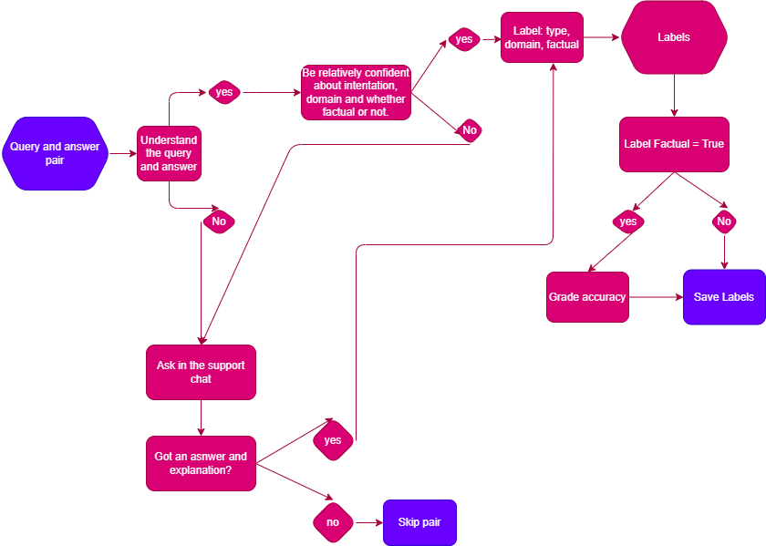

# Annotation Instructions

## Overview
As a super agent, your mission is to help improve GenAI by evaluating responses from a Large Language Model (LLM) such as ChatGPT. Each annotation sample consists of a user's question (query) and the LLM's answer. Your tasks include classifying the user's intent, determining the domain, and evaluating the factual accuracy of the information provided.

## Steps
* Read the Sample:
* Carefully read the user's question and the LLM's answer.
* Classify the User's Intent. Determine the primary purpose of the user's query. Common intent categories include:
  - Brainstorming
  - Chat
  - Classification
  - Extract
  - Generation
  - QA Closed 
  - QA Open
  - Rewrite
  - Summarisation
  - Other
* Classify the Domain:
  - General
  - Business
  - Tech
* Assess whether the information provided by the LLM is factual. Use reliable sources if needed to verify the accuracy.
Factual: The information is accurate and supported by credible sources.
Not Factual: The information is incorrect or misleading.
* Grade the Accuracy of the Answer (if factual):
If the answer is factual, assign a grade to its accuracy based on the following scale:
- 1 (Poor): The answer contains significant inaccuracies or is mostly incorrect.
- 2 (Fair): The answer has some inaccuracies but is partially correct.
- 3 (Good): The answer is mostly accurate with minor errors.
- 4 (Very Good): The answer is accurate with only trivial errors.
- 5 (Excellent): The answer is completely accurate and thorough.

## Use the Expert Room for Doubts:

If you have any uncertainties or need clarification, utilize the chat expert room to discuss with other annotators or experts.
Skip Difficult Questions:

If you encounter a particularly difficult question that you cannot evaluate, feel free to skip it and move on to the next sample.

## Example Annotation

Sample Question: "What happens if you eat watermelon seeds?"

LLM's Answer: "You grow watermelons in your stomach."

User's Intent: Information Seeking
Domain: Health & Medicine
Factual: No
Accuracy Grade: Not applicable (since the answer is not factual)
Remember, your annotations are crucial in helping to improve the accuracy and reliability of GenAI. Thank you for your diligent work and attention to detail in this important mission!

Feel free to reach out to the chat expert room if you have any questions or need further assistance. Happy annotating!
